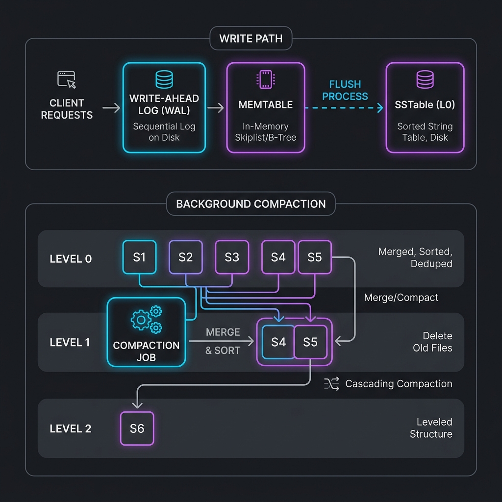

#  Mini LSM Engine

[](https://github.com/KAILASH-SOU/mini-lsm-engine/actions)
[](https://opensource.org/licenses/MIT)

A high-performance, single-node, disk-backed key–value storage engine built from scratch in C++17. This project implements the core components of modern databases like RocksDB and LevelDB using the **Log-Structured Merge Tree (LSM)** architecture.



---

##  Technical Architecture

The Mini LSM Engine is designed for high write throughput and crash resilience. It consists of four primary layers:

### 1. Write-Ahead Log (WAL)
Every write is first appended to a sequential file on disk. This ensures **durability** and allows the engine to recover state after a crash.

### 2. MemTable
An in-memory, sorted data structure (Sorted Map) that provides fast lookups and inserts. Once the MemTable reaches a size threshold, it is frozen and flushed to disk as an SSTable.

### 3. SSTables (Sorted String Tables)
Immutable disk files containing sorted key-value pairs. Each SSTable represents a snapshot of the database at a point in time.

### 4. Background Compaction
To maintain read performance and reclaim space, older SSTables are periodically merged into newer, larger files, deduplicating keys and removing stale values.

---

##  Key Features

- **Crash Resilience**: Fast recovery via WAL replay.
- **Write Efficiency**: Log-structured design prioritizes sequential disk I/O.
- **Automatic Compaction**: Background merging of SSTables to optimize storage.
- **Zero Dependencies**: Pure C++17 with no external library requirements.
- **Safe Concurrency**: Thread-safe MemTable operations.

---

## Build & Run

### Prerequisites
- A C++17 compliant compiler (e.g., `g++` or `clang++`)
- `make` (optional but recommended)

### Quick Start
```bash
# Clone the repository
git clone https://github.com/KAILASH-SOU/mini-lsm-engine.git
cd mini-lsm-engine

# Build the project
make

# Run the demo
make run
```

### Manual Compilation
If  don't have `make` installed:
```bash
g++ -std=c++17 -Iinclude src/*.cpp -o lsm_engine
./lsm_engine
```


